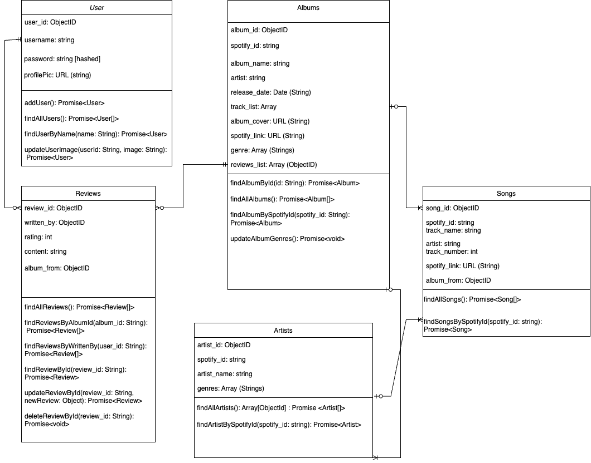

# UML Class Diagram

**Last Updated:** June 5, 2024

This UML Class Diagram represents the structure and relationships of our data model, including Users, Albums, Artists, Songs, and Reviews.

## Classes and Relationships

- **User**: Attributes and methods for user management.
- **Album**: Attributes and methods for album management.
- **Artist**: Attributes and methods for artist management.
- **Song**: Attributes and methods for song management.
- **Review**: Attributes and methods for review management.

For more detailed information, please refer to the diagram above.
